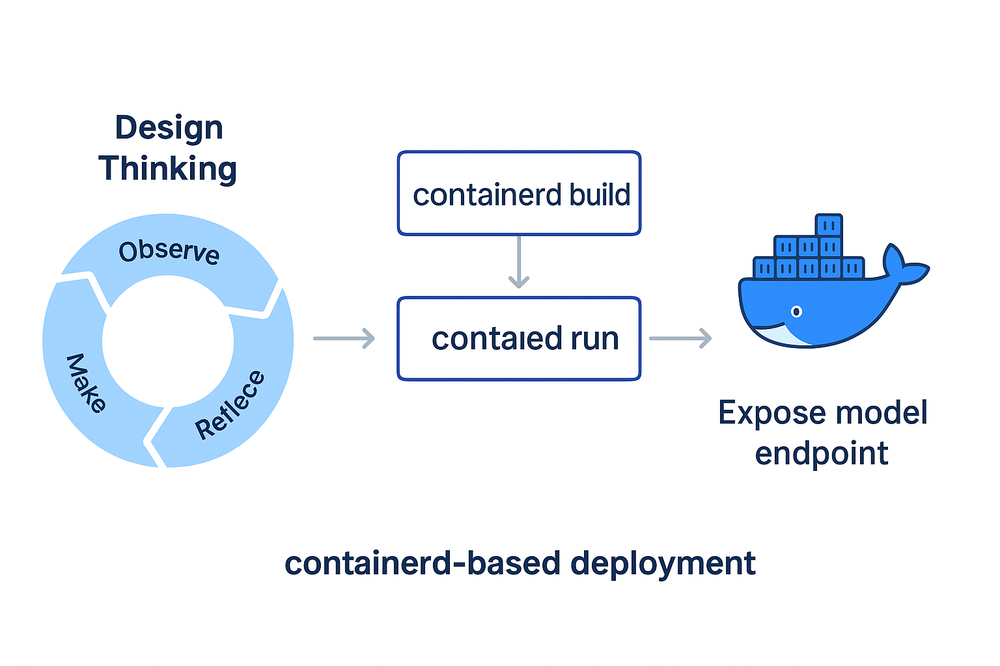

# Containers: Through the Eyes of Our Working Example

## Case Study
An organization employs engineers and data scientists from diverse technical backgrounds.  
It also introduces challenges — such as the use of different operating systems, programming tools, and development preferences.

To address this, organization technical leadership **standardized development and deployment** across teams by mandating that all software engineers, data scientists, and data engineers **ship services using containers**.

By adopting Containerization:
- All services share a **common, portable runtime environment**.
- A machine learning model can be distributed and used just like any other microservice.
- Cross-team collaboration has improved, as models and APIs are consistent and easy to deploy.
- **DevOps workloads** have decreased significantly, since environment issues are minimized.

## The Design Thinking Process

In enterprise-scale data science, models don’t just get built — they must be **deployed** for others to use.  
This deployment often occurs during the **Prototype** or **Test** phases of the **Design Thinking process**.

During these phases:
- Your model will be made available to users or stakeholders for evaluation.
- You’ll assess not only model performance but also **user experience and feedback**.
- The design thinking cycle — *Observe → Reflect → Make* — happens quickly, often requiring **rapid iteration** of model versions.

Because design thinking is **user-centric**, feedback loops are critical.  
As users interact with your models, they will request adjustments or new features, and you’ll need to **respond quickly**.

## Why Containers Matter

Docker containers make this rapid iteration possible by allowing you to:
- Quickly **package and deploy** your model as a microservice.
- Expose a **public endpoint** for testing and feedback.
- Seamlessly **update and redeploy** changes as the prototype evolves.

> **Essential Skill:** For a data scientist working in a large enterprise, mastering Docker and container-based deployment is crucial for bridging the gap between model development and production readiness.

**Next Steps:**
- Learn how to build, run, and manage Docker containers.  
- Practice exposing simple Flask- or FastAPI-based model endpoints within containers.  
- Understand how containers integrate into broader systems (e.g., Kubernetes, CI/CD pipelines).

[Previous Page](Spark-Submit.md) -  [Next Page](On-Container.md)
