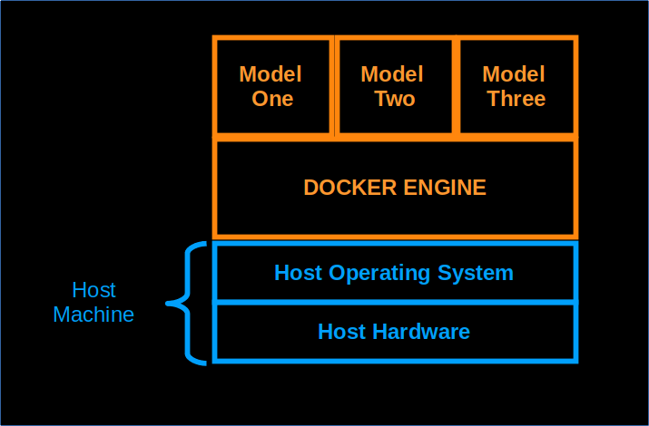

# On Containers and Docker

## Introduction to Containers

Containers are a lightweight form of virtualization that allows applications to run in isolated environments. Unlike traditional virtual machines, containers **share the host operating system kernel** but keep their processes, network, and filesystem isolated. This makes containers **faster to start, more efficient, and more portable** than VMs.

Containers are widely used in modern software development, particularly for **microservices, cloud deployment, and data science workflows**.

## What is Docker?

**Docker** is an open-source platform for **operating-system level containerization**. It allows developers to package applications along with all their dependencies, libraries, and configuration files into a single container image. This ensures that the application **runs consistently across different environments**, from a developer’s laptop to production servers.

### Key Features of Docker:
- **Portability:** Docker containers can run on any system that supports Docker, regardless of the underlying OS.
- **Isolation:** Each container has its own filesystem, processes, and network stack, preventing conflicts between applications.
- **Reusability:** Docker images can be versioned, shared, and reused across multiple projects.
- **Lightweight:** Containers share the host OS kernel, making them faster and smaller than virtual machines.

## Docker Engine and Community Edition

The **Docker Engine** is the core runtime that builds and runs containers. The community package of the Docker Engine is called **`docker-ce`** (Docker Community Edition). 

A Docker container can be thought of as a **running script or process** that includes all necessary components to execute an application. Containers sit on top of the host operating system, using **the kernel while maintaining isolation** from other processes.

## Docker Containers and Images

### Containers
- A **container** is a running instance of a Docker image.
- Each container is **isolated** from the host system and other containers.
- Containers interact with their **own private filesystem**, which is separate from the host filesystem.

### Images
- A **Docker image** is a **read-only template** that includes everything needed to run an application:
  - Application code
  - Runtime environment and libraries
  - Configuration files
  - Filesystem structure
- Images are used to create containers and can be **versioned, shared, and stored in registries** like Docker Hub.

## Why Docker is Popular in Data Science

In modern data science and AI workflows:
- Docker ensures that **machine learning models** run consistently across different environments.
- Data scientists can share models as **containerized services**, avoiding “it works on my machine” problems.
- Containers make it easier to **deploy AI services at scale** in production or cloud environments.

## Summary

Docker provides a **reliable, portable, and isolated environment** for applications. By combining containers and images, Docker allows developers and data scientists to:
- Build reproducible environments
- Avoid dependency conflicts
- Deploy applications and AI models easily
- Improve collaboration across teams

## Docker Architecture Diagram

